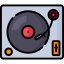

  

     

# TrackerMania

## Présentation
TrackerMania est un jeu de rythme libre inspiré par IIDX. Ce projet utilise le moteur de jeu Godot Engine 4.

Le jeu est en cours de développement, mais vous pouvez y jouer en Accès Anticipé™ ci-dessous (comme sur Steam wow!).

## Jouer au jeu
[Jouer sur navigateur](https://djalexkidd.github.io/trackermania)

[Télécharger le jeu](https://github.com/djalexkidd/trackermania/releases)

## Fonctionnalités
- [x] Gameplay de base
- [x] Mutateurs de jeu et options d'assistance (HI-SPEED, RANDOM, AUTO-SCRATCH...)
- [ ] Sauvegarde des scores
- [ ] Multijoueur local
- [x] Multijoueur en ligne
- [ ] Classements en ligne
- [ ] Éditeur de niveaux
- [ ] Téléchargement de contenu crée par la communauté
- [x] Importation de beatmaps Quaver
- [ ] Importation de BMS

## Crédits
Ce jeu contient du code source de ces projets :

[gd-rhythm](https://github.com/scenent/gd-rhythm)

[Websocket-Multiplayer-Demo-Godot-4.0](https://github.com/pleyland/Websocket-Multiplayer-Demo-Godot-4.0)
